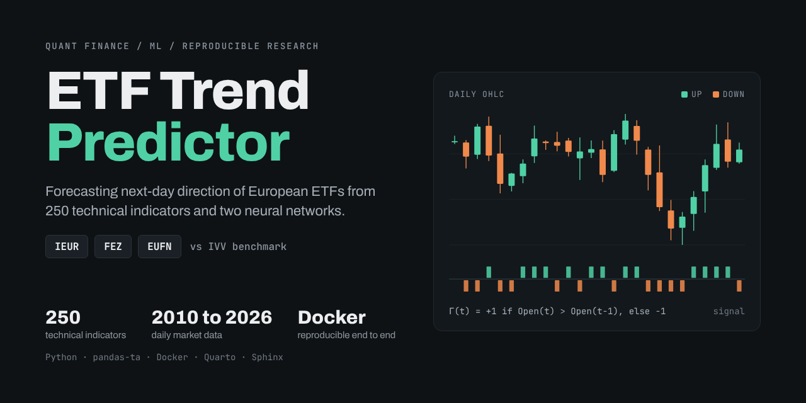
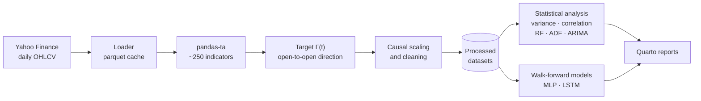
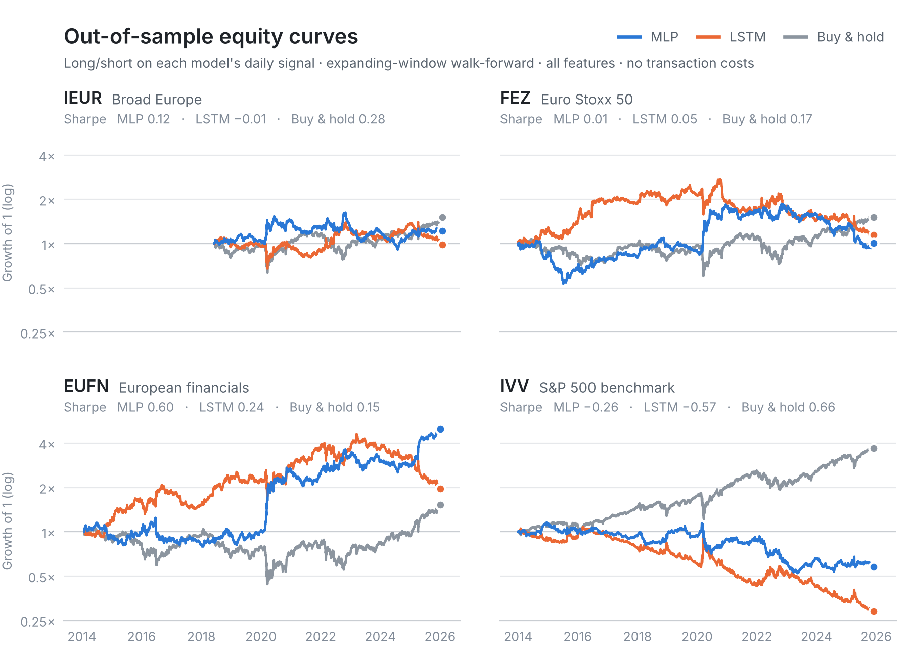

<p align="center">
  
</p>

<p align="center">
  <a href="https://hub.docker.com/r/milankalajdzic/etf-predictor"></a>
  
  
  
  <a href="https://github.com/MilanKalajdzic/ETF-Trend-Predictor/actions/workflows/ci.yml"></a>
  <a href="https://github.com/astral-sh/ruff"></a>
</p>

<p align="center">
  <b>Can 260+ technical indicators and a neural network call tomorrow's direction for European ETFs?</b><br>
  A reproducible replication and extension of
  <a href="https://doi.org/10.1515/econ-2022-0073">Sagaceta-Mejía et al. (2024)</a>,
  from raw prices to rendered reports in a single <code>docker run</code>.
</p>

<p align="center">
  <a href="#quick-start">Quick start</a> ·
  <a href="#how-it-works">How it works</a> ·
  <a href="#results">Results</a> ·
  <a href="#look-ahead-safety">Look-ahead safety</a> ·
  <a href="#reports">Reports</a> ·
  <a href="#development">Development</a> ·
  <a href="#limitations">Limitations</a>
</p>

---

## At a glance

| | |
|---|---|
| **Universe** | IEUR, FEZ, EUFN (Europe) against IVV (US benchmark) |
| **Data** | Daily OHLCV from Yahoo Finance, 2010 to April 2026 |
| **Features** | ~250 look-ahead-free technical indicators across 10 pandas-ta categories |
| **Target** | Γ(t) = +1 if Open(t) > Open(t−1), else −1 |
| **Models** | MLP signal classifier and LSTM next-day return regressor (PyTorch) |
| **Validation** | Expanding-window walk-forward, 16 to 25 six-month folds per ticker, benchmarked against buy-and-hold |
| **Baselines** | Random Forest feature importance, ADF stationarity tests, ARIMA(1,1,1) |
| **Reproducibility** | One Docker image, Makefile automation, 60 unit tests (73% coverage) run in CI, Sphinx API docs |

---

## Quick start

All you need is Docker.

```bash
docker pull milankalajdzic/etf-predictor:latest
mkdir output
docker run --rm -v "$PWD/output:/output" milankalajdzic/etf-predictor:latest
```

<details>
<summary>Windows PowerShell</summary>

```powershell
docker pull milankalajdzic/etf-predictor:latest
mkdir output
docker run --rm -v "${PWD}/output:/output" milankalajdzic/etf-predictor:latest
```

</details>

The default command (`make report`) runs the whole pipeline from scratch: download and process data, statistical analysis, MLP and LSTM walk-forward training, render all three Quarto reports and copy them to `output/`. Expect **about 10 minutes** on CPU.

> [!TIP]
> On Apple Silicon, if the pull fails, add `--platform linux/amd64` to both the `pull` and `run` commands.

---

## How it works



| Stage | Package | What it does |
|---|---|---|
| **1. Data** | `etf_predictor.data` | Downloads and caches prices, computes ~250 indicators and drops any that use future prices, builds the Γ(t) target, scales features to [0, 1] with an expanding window, drops sparse columns and forward-fills warm-up gaps |
| **2. Analysis** | `etf_predictor.analysis` | Low-variance and correlation redundancy checks, Random Forest feature importance, ADF stationarity tests, ARIMA(1,1,1) baseline |
| **3. Modeling** | `etf_predictor.models` | MLP signal and LSTM return models trained in an expanding window, long/short equity curves against buy-and-hold, top-10 feature ablation |

---

## Results

<picture>
  <source media="(prefers-color-scheme: dark)" srcset="assets/results-equity-dark.png">
  
</picture>

Out-of-sample walk-forward results, trading long/short on each model's daily signal, with all features and with only the top-10 Random Forest features. Annualised Sharpe ratios, no transaction costs:

| Ticker | MLP | LSTM | MLP top-10 | LSTM top-10 | Buy & hold |
|:---|---:|---:|---:|---:|---:|
| IEUR | 0.12 | −0.12 | 0.04 | 0.12 | 0.28 |
| FEZ | 0.01 | −0.17 | −0.12 | 0.23 | 0.17 |
| EUFN | 0.60 | −0.04 | 0.54 | 0.11 | 0.15 |
| IVV | −0.26 | 0.30 | −0.14 | 0.28 | 0.66 |

**The short version: technical indicators do not beat the market here.** On the US benchmark buy-and-hold earns a Sharpe of 0.66 and the best network reaches 0.30. On IEUR nothing comes close to buy-and-hold, and on FEZ only the top-10 LSTM edges past it (0.23 against 0.17), a gap that is gone at 2 bps of trading cost.

EUFN is the one exception, with the MLP at 0.60 (0.54 on the top-10 features) against 0.15 for buy-and-hold. We do not read this as an edge. Its hit rate is barely above 50%, and 59% of its log return comes from just ten days, most of them in the March 2020 crash and the April 2025 tariff selloff. A Sharpe of 0.60 over 12 years is a t-statistic of about 2.1, which does not survive a correction for the 16 runs in this table, and most of the edge disappears once trading costs are charged (below).

### Transaction costs

The networks change position 25 to 107 times a year, so trading costs matter. [`scripts/cost_sensitivity.py`](scripts/cost_sensitivity.py) re-scores every run with a one-way cost per unit traded, where a long-to-short flip trades two units. For the three runs that beat buy-and-hold before costs:

| Run | Position changes per year | 0 bps | 2 bps | 5 bps | Sharpe reaches zero at | Buy & hold |
|:---|---:|---:|---:|---:|---:|---:|
| EUFN MLP | 91 | 0.60 | 0.43 | 0.19 | 7.5 bps | 0.15 |
| EUFN MLP top-10 | 87 | 0.54 | 0.38 | 0.15 | 7.1 bps | 0.15 |
| FEZ LSTM top-10 | 82 | 0.23 | 0.06 | −0.17 | 2.8 bps | 0.17 |

At 2 bps per trade the FEZ LSTM falls below buy-and-hold, and at 5 bps the EUFN MLP is level with it, before any cost of holding the short side. The table for all 16 runs is in `reports/results/cost_sensitivity.csv`.

Per-fold metrics and equity curves are in the modeling report.

---

## Look-ahead safety

Backtests on technical indicators are easy to contaminate with future information, so the pipeline guards against it explicitly:

- **Causal indicators only.** Every pandas-ta indicator is recomputed on data truncated at day t and dropped if any earlier value changes. Five fail with their default settings and are excluded: DPO (centred), the Ichimoku chikou span, the `TOS_STDEVALL` regression bands, VHM and ZIGZAG. Ichimoku's forward projections, dated after the last trading day, are discarded.
- **Expanding-window scaling.** Features are min-max scaled with the range observed up to each day, never the full sample, so walk-forward folds see no future ranges.
- **Unadjusted prices.** Yahoo's `Adj Close` is back-adjusted with dividends paid later, so indicators are computed on the raw close.
- **End-to-end test.** The test suite rebuilds the processed dataset with the future cut off and fails if any past value changes.

---

## Reports

Running the pipeline produces three self-contained HTML reports:

| Report | Source | Contents |
|---|---|---|
| **EDA** | [`eda_report.qmd`](reports/eda_report.qmd) | Raw data, indicator construction, target definition, class balance, cleaning |
| **Statistical analysis** | [`statistical_analysis.qmd`](reports/statistical_analysis.qmd) | Feature variance, correlation redundancy, Random Forest importance, ADF tests, ARIMA baseline |
| **Modeling** | [`modeling_report.qmd`](reports/modeling_report.qmd) | MLP and LSTM walk-forward backtests, equity curves, per-fold metrics, top-10 feature ablation |

---

## Development

<details>
<summary><b>Build locally and run individual steps</b></summary>

```bash
docker compose build
docker compose run --rm etf-predictor bash
```

Inside the container:

| Target | Description |
|---|---|
| `make data` | Download and process all ETF data |
| `make eda` | Generate EDA figures to `reports/figures/` |
| `make analysis` | Run the statistical analysis |
| `make modeling` | Train MLP and LSTM with walk-forward validation, then score them net of trading costs |
| `make report` | Full pipeline, render all reports, publish to `/output` |
| `make render` | Re-render the Quarto reports from existing results (fast) |
| `make publish` | Copy `reports/*.html` to `/output` |
| `make test` | Run the unit tests |
| `make coverage` | Tests with an HTML coverage report |
| `make docs` | Build the Sphinx HTML docs to `docs/_build/html/` |
| `make lint` / `make format` | Ruff linter and formatter |

Every push and pull request runs Ruff and the full test suite on GitHub Actions ([`ci.yml`](.github/workflows/ci.yml)).

</details>

<details>
<summary><b>Project structure</b></summary>

```text
├── src/etf_predictor/
│   ├── data/          loader, indicators, targets, preprocessing, pipeline, visualization
│   ├── analysis/      variance, correlation, feature importance, time series (ADF, ARIMA)
│   └── models/        MLP signal, LSTM value, walk-forward validator, equity curves
├── tests/             data/, analysis/, models/
├── scripts/           generate_eda.py, run_analysis.py, run_modeling.py, cost_sensitivity.py
├── reports/           Quarto sources (.qmd) and results/*.csv
├── docs/source/       Sphinx configuration
├── assets/            social preview image and its HTML source
├── Dockerfile         Python 3.12 slim, CPU-only PyTorch, Quarto
├── docker-compose.yml services: etf-predictor, test, notebook
├── Makefile           automation targets
└── pyproject.toml     dependencies and Ruff configuration
```

</details>

<details>
<summary><b>Dataset</b></summary>

| Ticker | Fund | Exposure | History |
|---|---|---|---|
| **IEUR** | iShares Core MSCI Europe ETF | Broad Europe | 2014-06-12 to 2026-04-30 |
| **FEZ** | SPDR EURO STOXX 50 ETF | Eurozone large caps | 2010-01-04 to 2026-04-30 |
| **EUFN** | iShares MSCI Europe Financials ETF | European financials | 2010-02-03 to 2026-04-30 |
| **IVV** | iShares Core S&P 500 ETF | US benchmark | 2010-01-04 to 2026-04-30 |

Raw prices are cached as parquet under `data/raw/` and are not committed. IEUR history starts in June 2014 because that is all Yahoo Finance provides.

</details>

<details>
<summary><b>Compatibility notes</b></summary>

- pandas-ta 0.4.x removed the `Strategy` API, so indicators are computed one by one through the `df.ta` accessor
- yfinance returns MultiIndex columns, which the loader flattens
- Python 3.12 is required by pandas-ta 0.4.x
- statsmodels provides the ADF tests and ARIMA baseline

</details>

---

## Limitations

> [!NOTE]
> What the results above can and cannot tell you.

- **Same-day label.** Following the paper, Γ(t) is predicted from same-day indicators, so the Random Forest accuracy in the statistical report (76 to 81%) measures contemporaneous fit rather than forecasting skill. The MLP is trained on the same label but its signal trades the next day's return, so a next-day target would match training to trading.
- **Simple cost model.** Trading costs are a flat charge per unit traded (see [Transaction costs](#transaction-costs)). Borrowing costs for the short side and market impact are not modelled.
- **One seed per model.** Each network is trained with a single fixed seed, so how much these Sharpe ratios vary between training runs is unknown.

---

## Reference

Sagaceta-Mejía, A. R., Sánchez-Gutiérrez, M. E., & Fresán-Figueroa, J. A. (2024). An intelligent approach for predicting stock market movements in emerging markets using optimized technical indicators and neural networks. *Economics*, 18, 20220073. https://doi.org/10.1515/econ-2022-0073
